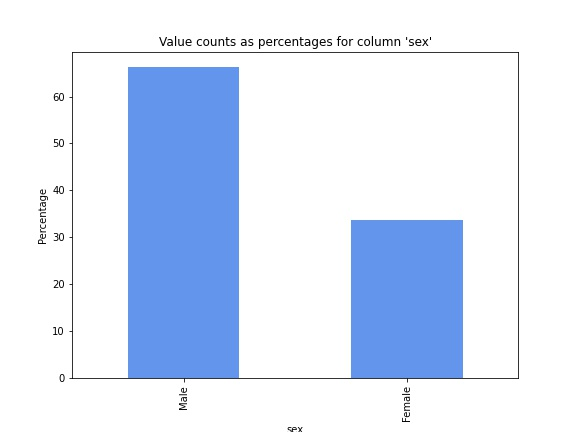

# Salary-and-Identity-Information-Analysis-for-Atlanta-City-Employees
This project investigates identity information to analyze the salaries of Atlanta City employees.  The created model helps visualize and mitigate potential implicit bias in future salary tables to protect both employers and employees.

## Overview and Business Understanding/Questions

My stakeholder is the city of Atlanta, who wishes verify whether there is any bias in their current salary tables and wants to mitigate that potential implicit bias in future salary tables for their employees.

Business Questions:

Is there any implicit bias among the salaries of Atlanta City Employees?

How can we mitigate any potential for implicit bias in our employees' salaries in the future?

## Data Source and Exploration
This data comes from Data World at the following site: https://data.world/brentbrewington/atlanta-city-employee-salaries. To download the file, click the download button in the upper right of the file. This will download a csv file titled atl_salary_data_2015.csv. You will need to either rename this file salaries.csv or replace the code in cell two of the notebook (labeled index.ipynb in this repository) with the following: df = pd.read_csv('atl_salary_data_2015.csv').
This dataset is from 2015.
Employee salary information along with identity information was gathered to create the dataset.
Most features in the dataset were used. These were:

* age
* sex
* ethnic.origin
* job.title
* organization
* annual.salary

The target feature is annual_salary.

I previewed and cleaned the data, including the following:
* Checked for placeholder values, duplicates, and null values
* Corrected typo in organization feature
* Removed parentheticals
* Dropped the names of the employees
* Previewed value_counts()
* Visualized feature distributions
* Analyzed and visualized median salaries by sex, ethnic.origin, and organization (department). 

I created the following visualizations for the exploration and analysis above (see index for all visualizations):

## Modeling
I wanted to determine the linearity of the dataset in relation to annual salary, so I created the following heatmap.

At witnessing the limited linearity, I decided to create a decision tree model.  I  ran an initial model, improved the model with Gradient Boosting, and then improved upon that model with GridSearch.

The CV score of the baseline model was about .40, the second model was about .50, and the last model was .71, suggesting that approximately 71.4% of the variance in the target variable is explained by this model.
The root mean squared error (RMSE) for the final model was 10512, which indicates that this model is accurate in determining annual salary based on the provided features and implicit bias present in the dataset within about 10,512 dollars.

Lastly, I created the following visualization to see the feature importances of this final model:

## Conclusion and Recommendations:

My exploratory analysis of the dataset suggests that there could be implicit bias in the salaries of Atlanta City Employees. Particularly when it comes to ethnic.origin with police officers and firefighters, black employees make less than white employees.  Morever, the top three departments with the most employees (Atlanta Fire and Rescue, Atlanta Police Department, and the Department of Watershed Management) all pay their black employees less than their white employees overall.  Two of these departments (Atlanta Police Department and the Departmenf of Watershed Management) pay their female employees less than their male employees overall. This disparity compounds with ethnicity, leading to Black Female employees being paid the least, then Black Male employees, then White Female employees, then White Male employees at the top being paid the most. 

The final model serves as a useful tool for showcasing the potential for implicit bias given the salary and identity information from the 2015 dataset.  It should not be used to create equitable salaries for future employees (which would be a future model), but instead be used to inform the city of Atlanta the ways in which the current system in place privileges certain employees over others. 

Additional data about the Atlanta city employees could prove useful for a full equity analysis, including years of experience, education, and additional training.  A future model could be created to combat the implicit biases and create a more equitable salary table, but this should be combined with efforts to combat the implicit biases already present in the system.  The City of Atlanta may need to investigate its hiring and advancement practices, for example, to counter the problem more effectively. 
An analysis of the most important features in the curernt model suggests that job.title plays the most important role. Further exploration among different job.titles in different departments could illustrate this potential for implicit bias further. It is possible that the relationship between job.title and ethnic.origin contribute to the the implicit bias present in the departments, especially if mostly white male employees are at the top of the employment and salary scale. Further analysis of the relationship between these features and other features like experience and advancement track records may be needed to better combat the implicit bias present in the current system.

In summary: 

Implicit bias does seem to have affected the employees of the City of Atlanta as of the 2015 data. This model provides a way to showcase that implicit bias for informative purposes and should not be implemented for the creation of an equitable salary. Further analysis of the relationship especially between job.title and ethnic.origin may prove helpful in combatting the bias present in the current salary system, and this analysis should include the employees' years of experience, job level, the departments' methodologies for advancement, and other similar data to better effect equitable salaries in the future. 

## Navigating the repository:
* Data for this project can be found in the salaries.csv file

* index.ipynb contains the coding and markup

* presentation.pdf is PowerPoint presentation of my information for my stakeholder, the link for which presentation can be found [here](https://docs.google.com/presentation/d/145CUS-sFABGBPzdnP9Fgd35gkQgx8ZTGBePJ7bENO3k/edit?usp=sharing).

